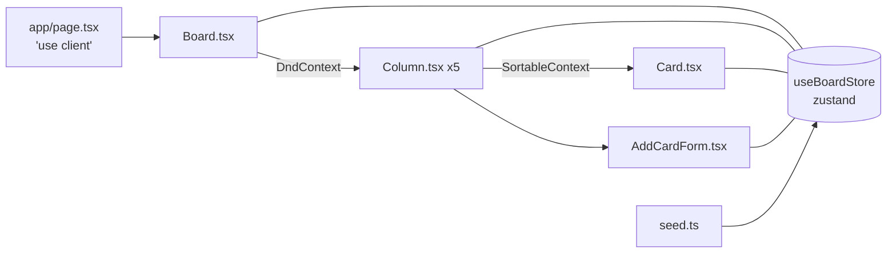

# Kanban MVP Plan

## Stack

- Next.js 15 (App Router) + TypeScript + Tailwind CSS, client-rendered
- `@dnd-kit/core` + `@dnd-kit/sortable` for drag-and-drop (the de-facto modern React DnD library)
- `zustand` for board state (one tiny store, no Context boilerplate)
- `lucide-react` for icons, Inter via `next/font`
- Vitest + React Testing Library + jsdom for unit tests
- Playwright for end-to-end tests

## Architecture



State shape (normalized, simple):

```ts
type Card = { id: string; title: string; details: string };
type Column = { id: string; title: string; cardIds: string[] };
type BoardState = {
  columns: Column[]; // length 5, fixed order
  cards: Record<string, Card>;
  renameColumn: (id: string, title: string) => void;
  addCard: (columnId: string, title: string, details: string) => void;
  deleteCard: (cardId: string) => void;
  moveCard: (cardId: string, toColumnId: string, toIndex: number) => void;
};
```

## Brand Palette

Map directly into `tailwind.config.ts` under `theme.extend.colors.brand`:
`navy #032147`, `blue #209dd7`, `purple #753991`, `yellow #ecad0a`, `gray #888888`. Navy for headings, purple for primary buttons, blue for links/active states, yellow for accent lines/focus rings, gray for secondary text.

## Phase 1 — Scaffolding

- Root `.gitignore` covering `node_modules`, `.next`, `coverage`, `playwright-report`, `test-results`, `.env*`
- `npx create-next-app@latest frontend --ts --tailwind --eslint --app --src-dir --no-import-alias --use-npm` (no Turbopack flag flips needed; defaults are current)
- Install runtime: `@dnd-kit/core @dnd-kit/sortable @dnd-kit/utilities zustand lucide-react`
- Install dev: `vitest @vitejs/plugin-react @testing-library/react @testing-library/jest-dom @testing-library/user-event jsdom @playwright/test`
- Add `vitest.config.ts` (jsdom, setup file with jest-dom matchers), `playwright.config.ts` (auto-start `npm run dev` on port 3000)
- Extend Tailwind with `brand.*` colors and Inter via `next/font`

Success criteria:
- `npm run dev`, `npm run build`, `npm run lint`, `npm test`, `npx playwright test --list` all succeed/exit cleanly

## Phase 2 — State + Seed

- `frontend/src/lib/seed.ts`: 5 columns (Backlog, To Do, In Progress, Review, Done) with 6-8 realistic dummy cards distributed across them
- `frontend/src/lib/store.ts`: zustand store with actions above; `moveCard` handles same-column reorder and cross-column moves
- `frontend/src/lib/store.test.ts`: unit-test each action (rename, add, delete, move within column, move across columns, no-op moves)

Success: 100% of store actions covered, all Vitest tests pass.

## Phase 3 — UI Components

- `frontend/src/app/layout.tsx`: Inter font, navy heading bar with board title "Kanban Board" and a subtle yellow accent underline
- `frontend/src/app/page.tsx` (`'use client'`): renders `<Board />`
- `frontend/src/components/Board.tsx`: horizontal 5-column grid (CSS grid), wraps `<DndContext>` with `closestCorners` collision detection and `onDragEnd` calling `moveCard`
- `frontend/src/components/Column.tsx`: column with inline-editable title (click-to-edit, blur/Enter to save), `<SortableContext>` body, footer "+ Add card" button revealing inline form; column accent stripe in brand colors
- `frontend/src/components/Card.tsx`: rounded card with title (bold navy), details (gray), hover lift, delete (trash icon, ghost until hover), draggable via `useSortable`
- `frontend/src/components/AddCardForm.tsx`: title + details fields, purple "Add" submit button, Cancel link in blue
- Component unit tests for rename, add, delete, and render-with-seed

Success: visually polished (rounded corners, soft shadows, hover transitions, focus rings in brand yellow), keyboard-accessible, all component tests pass.

## Phase 4 — Playwright E2E

`frontend/e2e/board.spec.ts`:
- Loads with 5 columns and seed cards visible
- Rename a column persists for the session
- Add a new card appears in target column
- Delete removes the card
- Drag card within a column reorders it
- Drag card across columns moves it (use `page.mouse` or `dragTo` with bounding box)

Success: all specs pass headless on Chromium.

## Phase 5 — Deliver

- Minimal `frontend/README.md`: install, dev, test, e2e commands only (no emojis)
- `npm run lint && npm run build && npm test && npx playwright test` all green
- Leave `npm run dev` running for the user on http://localhost:3000

## Key Files

- [AGENTS.md](AGENTS.md) — source of requirements
- `frontend/src/lib/store.ts` — single source of truth for board state
- `frontend/src/components/Board.tsx` — DnD context root
- `frontend/tailwind.config.ts` — brand palette
- `frontend/e2e/board.spec.ts` — integration coverage
